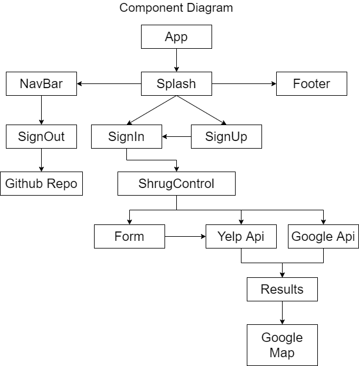
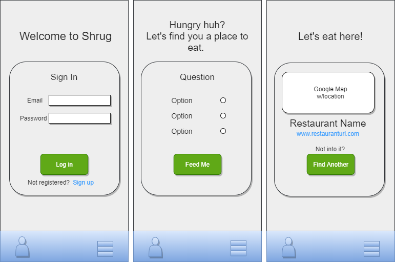

<br />

#### By Tyler Bates
<hr/>

## Proposal

A React Web application for a restuarant suggestion generator. <br>
The user signs in and is prompted to input their price range and zip code. The application will then return a restaurant within the parameters of the user inputs. 
<hr />

## Component Diagrams
### App Design


### Card Design


<hr/>

## Logistics

||Minimum Product Features|
|-----|-----|
| :heavy_check_mark: |User can register|
| :heavy_check_mark: |User can log in with registered email and password|
| :heavy_check_mark: |User can log out from navigation menu|
| :heavy_check_mark: |User can access the projects github repository from navigation menu|
|  |User can input preferred price range and zip code|
|  |Results card will output random restaurant within parameters|
|  |Results card will include GoogleMap pinned location of restaurant|
|  |User can re-roll if not satisfied with output restaurant|

<br/>
<br/>

||Stretch Goals|
|-----|-----|
| :heavy_check_mark: |Clean, Responsive UI|
|  |Adding results to database to prevent duplicate results|
|  |Using IBM Watson API for chatbot interactivity|
|  |Search functionality for restaurants in general area|
|  |Hosting|

<hr />


## Setup/Installation Requirements

1. Clone this projects repository into your local directory following [these](https://www.linode.com/docs/development/version-control/how-to-install-git-and-clone-a-github-repository/) instructions.

2. Open the now local project folder with [VSC](https://code.visualstudio.com/Download) or an equivalent

3. Navigate to the project directory from your terminal by entering the following:

```
$ cd ~/shrug-js
```
4. Within the projects directory install all required dependencies with
```
$ npm install
```
5. Run the application to view in your browser with
```
$ npm run start
```

>If the browser does not automatically launch, view the project [here](https://localhost:3000)

<hr/>

## Known Bugs

### There are no known bugs at this time
If you have a bug or an idea, browse the open issues before opening a new one. You can also take a look at the [Open Source Guide](https://opensource.guide/).

<hr/>

## Technologies Used

- JavaScript
- React
- Firebase
- Firestore
- Yelp Api
- Google Api
- IBM Watson Api
- Puppeteer
- Redux
- Reactstrap
- Bootstrap
- HTML
- CSS
- Git

<hr/>

## Legal

#### Apache License V2.0

Copyright 2020 Tyler Bates @ Epicodus

Licensed under the Apache License, Version 2.0 (the "License");
you may not use this file except in compliance with the License.
You may obtain a copy of the License at

http://www.apache.org/licenses/LICENSE-2.0

Unless required by applicable law or agreed to in writing, software
distributed under the License is distributed on an "AS IS" BASIS,
WITHOUT WARRANTIES OR CONDITIONS OF ANY KIND, either express or implied.
See the License for the specific language governing permissions and
limitations under the License.